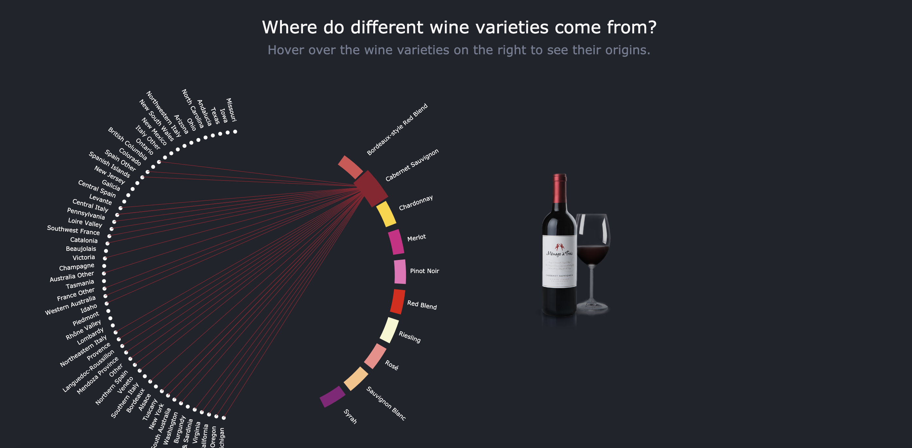
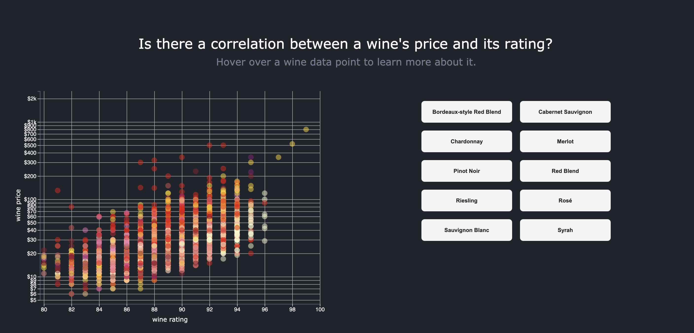
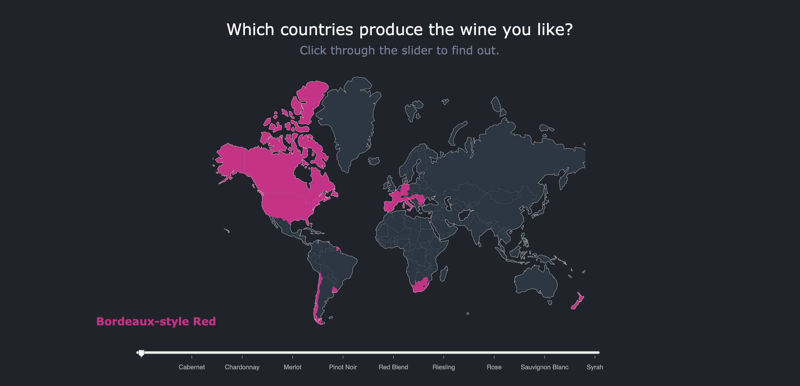

# INFO/CS 3300 - Project 2 - Spring 2019
Project submission by Adam Liu (al838), April Ye (yy459), Cindy Zhang (lz247)

## Overview

To run project on ```localhost:8000```:
- Python 3: ```python -m http.server```
- Python 2: ```python -m SimpleHTTPServer 8000```





## Wines Reviews
* First visualization by Adam
* Second visualization by April
* Third visualization by Adam, April and Cindy

## References
* Wine Reviews dataset - https://www.kaggle.com/zynicide/wine-reviews

## Languages Used
* D3.js
* CSS
* HTML
* Javascript
